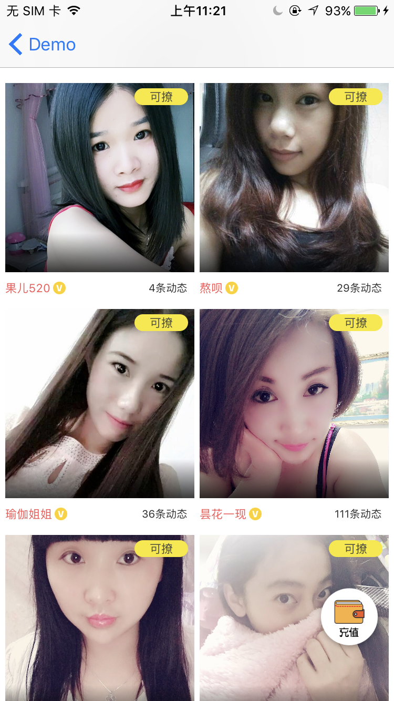
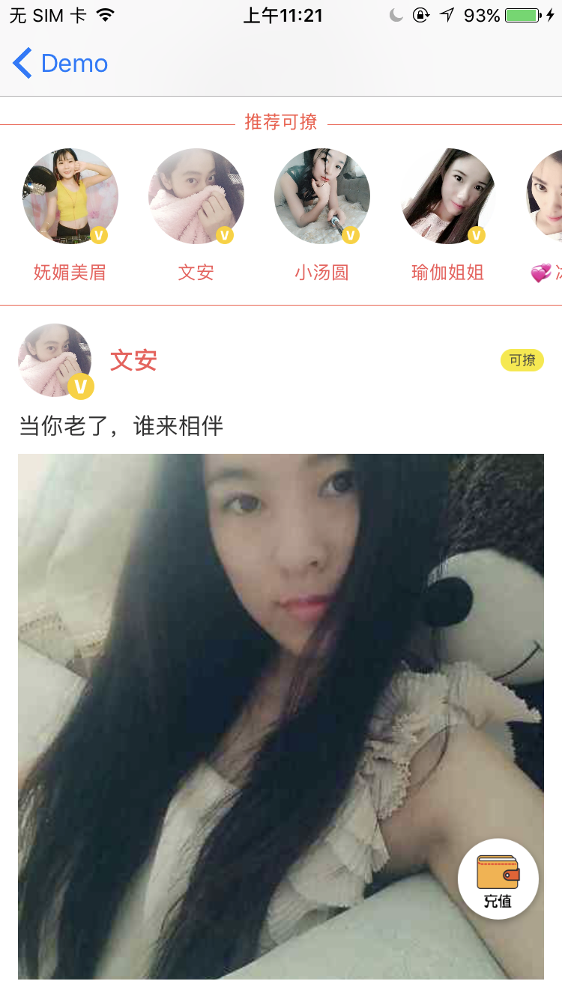
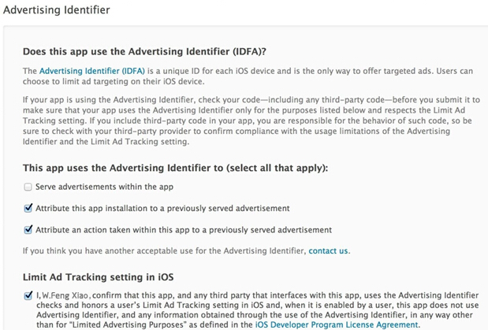

AstraeaSwfit 是一套一对一视频聊天解决方案，采用Swift编写


- [功能简介](#功能简介)
- [系统需求](#系统需求)
- [集成](#集成)
- [使用](#使用)


## 功能简介
- [x] 获取可聊天的用户列表
- [x] 获取用户动态列表
- [x] 获取在线用户数
- [x] 夜间/白天 模式切换

## 系统需求
- iOS 8.0+

## 集成
采用[CocoaPods](http://cocoapods.org)
在Podfile中：
```ruby
source 'https://github.com/CocoaPods/Specs.git'
platform :ios, '8.0'
use_frameworks!

target '<Your Target Name>' do
    pod 'AstraeaSwift'
end
```
### 注意
框架内部依赖一些第三方框架，如果冲突可以适当进行删除和修改。

## 使用
### 初始化
在使用本框架前，需要先初始化
```
func application(_ application: UIApplication, didFinishLaunchingWithOptions launchOptions: [UIApplicationLaunchOptionsKey: Any]?) -> Bool {
    AppConfig.start(with: "userId")
    AppConfig.setAppConfigDelegate(delegate: self)
    return true
}
```
`start`方法可以带入当前App登录用户的UserId，以便后续使用
`AppConfigDelegate`可设置相关事件回调
### 用户绑定
在设置了`AppConfigDelegate`后，框架触发登录操作后，会调用
```
func requestLogin(from controller: UIViewController?) {
   let alert = UIAlertController(title: "是否转换为DUDU账户", message: nil, preferredStyle: .alert)
   let cancelAction = UIAlertAction(title: "取消", style: .cancel, handler: nil)
   let confirmAction = UIAlertAction(title: "确定", style: .default) { (alert) in
       self.bindUser()
   }
   alert.addAction(cancelAction)
   alert.addAction(confirmAction)
   window?.rootViewController?.present(alert, animated: true, completion: nil)
}
```
在App内登录后，需要转换为视频聊天用户，调用框架接口进行绑定
```
func bindUser() {
    AppConfig.bindUser(
        userId: "test-123",
        mobile: "18618439364",
        nickname: "吸管",
        avatar: "http://tva3.sinaimg.cn/crop.0.7.1243.1243.180/71894349jw8fa9dof3ylej20yj0yxq5e.jpg",
        gender: 1) { (error) in
                
     }
 }
```
### 获取聊天用户列表
- 使用框架提供的界面
```
let anchorsVc = AnchorsViewController()
navigationController?.pushViewController(anchorsVc, animated: true)
```

- 使用框架提供的数据，需要自己定制页面
```
AppConfig.fetchActiveUsers { (users, error) in

}
```
### 获取动态列表
- 使用框架提供的界面
```
let momentsVc = MomentsViewController()
navigationController?.pushViewController(momentsVc, animated: true)
```

- 使用框架提供的数据，需要自己定制页面
```
AppConfig.fetchMoments(pageSize: 1) { (moments, error) in
            
}
```
### 获取在线用户数
```
AppConfig.fetchUserCount(completion: { (count, error) in
    if let er = error {
        self.numLabel.text = er.userInfo[NSLocalizedDescriptionKey] as? String
    } else {
        self.numLabel.text = "\(count)"
    }
})
```
### 夜间模式
框架内页面支持白天/夜间模式，可以自由配置
```
AppConfig.setNightMode(isNight: sender.isOn)
```
## 重要！提交到AppStore
### 由于框架内部分机制可能审核不通过，所以需要对框架进行上线前影藏操作，上线后再开放该功能
### 由于Appstore禁止不使用广告而采集IDFA的app上架，SDK中采集IDFA是为了获得更精确的新闻推荐。如果您的应用使用SDK而未集成任何广告服务，请按照下图填写Appstore中的IDFA选项：

- serve advertisements within the app服务应用中的广告。如果你的应用中集成了广告的时候，你需要勾选这一项。
- Attribute this app installation to a previously served advertisement.跟踪广告带来的安装。
- Attribute an action taken within this app to a previously served advertisement跟踪广告带来的用户的后续行为。
- Limit Ad Tracking setting in iOS这一项下的内容其实就是对你的应用使用idfa的目的做下确认，只要你选择了采集idfa，那么这一项都是需要勾选的。

如果您仍因为采集IDFA被Appstore审核拒绝，建议您集成任意一家广告SDK，上线后可以控制其关闭展示。
